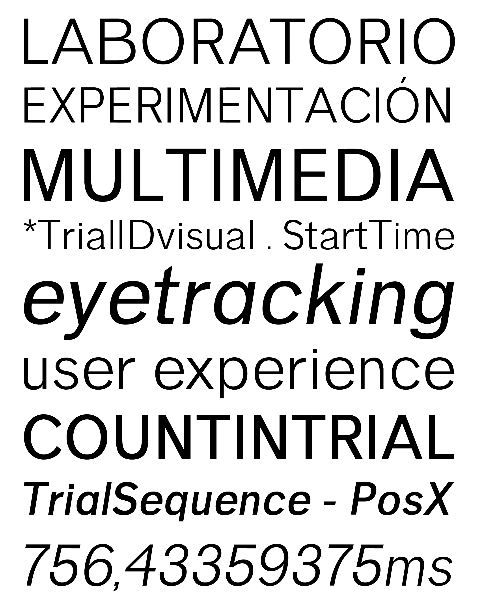

# LEM Pro 

**LEM Pro** es la familia tipográfica oficial del **Laboratorio de Experimentación Multimedia (LEM)**, perteneciente a la Facultad del Hábitat de la Universidad Autónoma de San Luis Potosí (UASLP).

Este repositorio aloja los archivos fuente de diseño y las compilaciones de producción de la familia, estructurados bajo estándares profesionales de desarrollo tipográfico y control de versiones.

## Estructura de la Familia (12 Estilos - Release)
La familia compilada en producción se compone de **6 pesos** con sus correspondientes variantes **Upright** (Romana) e **Italic** (Cursiva), sumando un total de **12 instancias estáticas** disponibles en formatos **OTF** (Desktop) y **WOFF** (Webfonts):

| Estilo / Instancia | Upright | Italic | Weight Class | Archivos (OTF / WOFF) | PostScript Name |
| :--- | :---: | :---: | :---: | :--- | :--- |
| **Light** | ✓ | ✓ | 300 | `LEMProLight.otf` / `.woff` `LEMProLightItalic.otf` / `.woff` | `LEMProLight` `LEMProLightItalic` |
| **Regular** | ✓ | ✓ | 400 | `LEMProRegular.otf` / `.woff` `LEMProRegularItalic.otf` / `.woff` | `LEMProRegular` `LEMProRegularItalic` |
| **Medium** | ✓ | ✓ | 500 | `LEMProMedium.otf` / `.woff` `LEMProMediumItalic.otf` / `.woff` | `LEMProMedium` `LEMProMediumItalic` |
| **SemiBold** | ✓ | ✓ | 600 | `LEMProSemiBold.otf` / `.woff` `LEMProSemiBoldItalic.otf` / `.woff` | `LEMProSemiBold` `LEMProSemiBoldItalic` |
| **Bold** | ✓ | ✓ | 700 | `LEMProBold.otf` / `.woff` `LEMProBoldItalic.otf` / `.woff` | `LEMProBold` `LEMProBoldItalic` |
| **ExtraBold** | ✓ | ✓ | 800 | `LEMProExtraBold.otf` / `.woff` `LEMProExtraBoldItalic.otf` / `.woff` | `LEMProExtraBold` `LEMProExtraBoldItalic` |

## Especificaciones Técnicas (Font Specs)
* **Formatos de Distribución:**
  * **Desktop / Print:** OpenType CFF (`.otf`) compilado con curvas PostScript (cúbicas).
  * **Webfonts:** Web Open Font Format (`.woff`) optimizado para bajo peso de transferencia y renderizado en navegadores web.
* **Ubicación de Compilación y Release:** `builds/release/` (paquetes `.zip`), `builds/otf/proof/` (`.otf`) y `builds/woff/proof/` (`.woff`).
* **Unidades por Em (UPM):** 1024.
* **Set de Glifos por Archivo:** 470 glifos (cobertura Latin extendida con diacríticos, versalitas, figuras numéricas tabulares y elzevirianas, y ligaduras). *Nota: El archivo de diseño fuente master en `sources/` cuenta con 954 glifos.*
* **OpenType Features (GSUB):** 
  * `aalt` — *Access All Alternates*
  * `c2sc` — *Capitals to Small Caps*
  * `case` — *Case-Sensitive Forms*
  * `ccmp` — *Glyph Composition/Decomposition*
  * `liga` — *Standard Ligatures*
  * `lnum` — *Lining Figures*
  * `locl` — *Localized Forms*
  * `onum` — *Oldstyle Figures*
  * `smcp` — *Small Capitals*

## Soporte de Idiomas (Language Support)
Soporte para más de 100 idiomas de base latina:

> Afrikaans • Albanian • Asu • Basque • Bemba • Bena • Bosnian • Catalan • Cebuano • Chiga • Cornish • Corsican • Croatian • Czech • Dutch • Embu • English • Estonian • Filipino • Finnish • Friulian • Galician • German • Guadeloupean Creole • Gusii • Haitian Creole • Ido • Indonesian • Interlingua • Irish • Iskonawa • Italian • Javanese • Jju • Kabuverdianu • Kalenjin • Kamba • Kikuyu • Kinyarwanda • Lojban • Lower Sorbian • Luo • Luxembourgish • Luyia • Machame • Makhuwa-Meetto • Makonde • Malagasy • Malay • Manx • Māori • Martinican Creole • Meru • Morisyen • Nheengatu • North Ndebele • Northern Sotho • Nyanja • Nyankole • Occitan • Oromo • Polish • Portuguese • Romansh • Rombo • Rundi • Rwa • Samburu • Sango • Sangu • Sardinian • Scottish Gaelic • Sena • Serbian • Shambala • Shipibo-Konibo • Shona • Slovak • Slovenian • Soga • Somali • South Ndebele • Southern Sotho • Spanish • Sundanese • Swahili • Swati • Swedish • Swiss German • Taita • Taroko • Teso • Tsonga • Tswana • Turkish • Turkmen • Upper Sorbian • Vunjo • Welsh • Wolastoqey • Xhosa • Zulu

## Estado de Producción
Las **12 instancias estáticas** en formatos **OTF** y **WOFF** listas para distribución se ubican en:
* [`builds/release/`](builds/release/) — Paquetes oficiales de distribución (`LEMPro_OTF.zip` y `LEMPro_WOFF.zip`), incluyendo el archivo `EULA.txt`.
* [`builds/otf/proof/`](builds/otf/proof/) — Archivos binarios individuales `.otf`.
* [`builds/woff/proof/`](builds/woff/proof/) — Archivos binarios individuales `.woff`.

El archivo fuente master en formato Glyphs (`sources/LEM Pro fam.glyphs`) se encuentra estructurado para facilitar el mantenimiento y la compilación de fuentes variables (Variable Fonts).

## Sobre el Laboratorio
El Laboratorio de Experimentación Multimedia (LEM) es un espacio multidisciplinario de la UASLP enfocado en el diseño paramétrico, la percepción visual y la experimentación digital.
🌐 [Visita el sitio oficial del Laboratorio de Experimentación Multimedia](https://lem.uaslp.mx)

---

## Pruebas de Rendering y QA
1. Descarga las fuentes compiladas desde [`builds/release/`](builds/release/) o explora las versiones individuales en [`builds/otf/proof/`](builds/otf/proof/) o [`builds/woff/proof/`](builds/woff/proof/).
2. **Fuentes Desktop (OTF):** Instala los archivos `.otf` en tu sistema operativo o gestor de fuentes y valida la vinculación de estilos (*Style Linking*) con los atajos de teclado (**B** / **N** para negritas y **I** / **K** para itálicas).
3. **Fuentes Web (WOFF):** Comprueba el renderizado web e incrustación con `@font-face` en navegadores y herramientas de inspección como *Font Gauntlet*.

## Licencia y EULA
Esta tipografía se distribuye bajo la licencia abierta **SIL Open Font License 1.1** detallada en el archivo [LICENSE.txt](LICENSE.txt). Puedes consultar los términos de uso y derechos de distribución en el [Acuerdo de Licencia de Usuario Final (EULA.md)](EULA.md).

